# Auditoría de Seguridad y Paginación (NEWLAB)

Este documento detalla las mejoras de seguridad y optimizaciones de rendimiento implementadas en **NEWLAB** en respuesta a la auditoría técnica basada en antipatrones comunes de desarrollo de software ("vulnerabilidades de software en despliegues auto-hospedados").

---

## 1. Vulnerabilidades Mitigadas

Se realizó un análisis exhaustivo del backend y del entorno de despliegue en **Coolify (VPS)**, resolviendo los siguientes puntos críticos:

| Antipatrón / Vulnerabilidad | Estado | Solución Implementada |
| :--- | :---: | :--- |
| **Contraseñas en texto plano** | ✅ Mitigado | Todas las contraseñas se encriptan con `bcryptjs` (10 rondas de salt) en la base de datos. Ningún endpoint retorna hashes de contraseñas. |
| **Endpoint de listado masivo (medio giga de response)** | ✅ Mitigado | Se implementó paginación segura con modo dual en `GET /api/pedidos`, limitando el consumo de memoria en base de datos y red. |
| **Falta de Rate Limiting (Ataques de Denegación de Servicio)** | ✅ Mitigado | Integración de `express-rate-limit` en la raíz del servidor. Bloquea peticiones abusivas por IP (límite de 300 peticiones cada 15 minutos en producción). |
| **Puerto de Base de Datos expuesto públicamente** | ✅ Mitigado | El puerto de la base de datos PostgreSQL en Coolify se cerró al exterior desactivando *Make it publicly available*. La conexión con el backend es 100% interna a nivel de red Docker. |

---

## 2. Detalles Técnicos de la Implementación

### A. Paginación de Pedidos en Modo Dual

Para evitar romper la interfaz de usuario existente (que espera recibir un array directo de pedidos en lugar de un objeto estructurado), el endpoint `GET /api/pedidos` implementa un **modo dual**:

1. **Modo Retrocompatible (Por defecto)**:
   * Si la petición no incluye parámetros de paginación, la API responde con un **Array plano `[]`**.
   * Para proteger la base de datos y evitar respuestas pesadas, se inyecta un límite de seguridad máximo de **200 registros** a la query SQL.
2. **Modo Paginado**:
   * Si la petición incluye los query params `page` y `limit` (o `paginated=true`), la API responde con la estructura:
     ```json
     {
       "data": [...],
       "pagination": {
         "page": 1,
         "limit": 10,
         "total": 45,
         "pages": 5
       }
     }
     ```

#### Consulta SQL Optimizada (PostgreSQL Window Function)
En [orderPgRepository.js](file:///d:/Archivos%20personales/Codigo/NEWLAB/backend/src/modules/orders/infrastructure/repositories/orderPgRepository.js), se utiliza la función de ventana `COUNT(*) OVER()` para obtener el total de registros en la misma consulta que obtiene los datos paginados:
```sql
SELECT *, COUNT(*) OVER() as total_count 
FROM nl_pedidos 
ORDER BY created_at DESC 
LIMIT $1 OFFSET $2;
```
* **Fallback ante páginas fuera de límites**: Si se solicita una página superior a la cantidad de datos existentes, la función de ventana no retorna filas (y por lo tanto no tendríamos el total). El repositorio detecta esto y ejecuta automáticamente una query de conteo rápido (`SELECT COUNT(*)`) para mantener la respuesta estructurada con el total correcto.

---

## 3. Arquitectura de Despliegue Seguro (Coolify)

El despliegue está estructurado dentro del VPS del usuario usando **Coolify**:

```mermaid
graph TD
    User([Cliente / Internet]) -->|HTTPS| Proxy[Proxy Inverso Coolify / Traefik]
    Proxy -->|Mapea dominio principal| Frontend[Contenedor Frontend - Svelte/React]
    Proxy -->|Mapea bak.affinixlab.com| Backend[Contenedor Backend - Node.js/Express]
    Backend -->|Conexión Interna - Puerto 5432| DB[(Contenedor PostgreSQL)]
    
    style DB fill:#1b2a4a,stroke:#3498db,stroke-width:2px;
    style Backend fill:#1b2a4a,stroke:#3498db,stroke-width:2px;
    style Proxy fill:#2c3e50,stroke:#7f8c8d;
```



* **Aislamiento de la Base de Datos**: La base de datos no tiene mapeo de puertos hacia el exterior. Solo es visible dentro de la red virtual de Docker compartida con el backend.
* **Variable de Entorno `DATABASE_URL`**: En el panel de Coolify del backend, se utiliza la dirección de red de Docker interna expuesta por Coolify (obtenida del campo *Postgres URL (internal)* con el formato `postgresql://user:password@<container_id>:5432/<db_name>`).
* **CORS y Orígenes**: El backend (`backend/src/index.js`) tiene CORS configurado dinámicamente y solo acepta peticiones desde la variable `FRONTEND_ORIGIN` en producción (apuntando a `https://affinixlab.com`).

---

## 4. Comandos de Verificación y Pruebas

Para validar los cambios localmente en futuros ciclos de desarrollo:

* **Pruebas de Integración y Regresión**:
  ```bash
  cd backend
  npm run test:order-payment-invoice-e2e
  ```
* **Prueba de Humo (Smoke Test)**:
  ```bash
  cd backend
  SMOKE_BACKEND_URL=https://bak.affinixlab.com SMOKE_FRONTEND_URL=https://affinixlab.com npm run smoke
  ```
