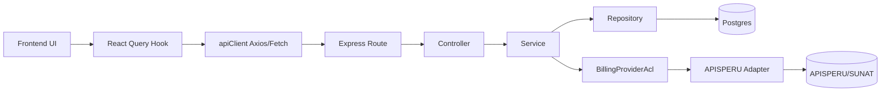

# Design: Refactor arquitectura backend/frontend

## Technical Approach

We will refactor by vertical domains (`orders`, `finance`, `billing`, `dashboard`) while preserving current HTTP contracts. Backend routes become thin adapters over `controller -> service -> repository` plus infrastructure adapters; frontend server-state moves to TanStack Query with explicit query keys/invalidation; shared DTOs/enums move to `packages/contracts` with zod runtime guards. This matches proposal phases F1-F4 and spec requirements 1-4.

## Architecture Decisions

| Decision | Option | Tradeoff | Outcome |
|---|---|---|---|
| DI pattern | Factory functions + closures (`makeX({ depA, depB })`) | Less OOP familiarity than classes, but lower ceremony in current JS ESM codebase | **Chosen**: easiest incremental migration from current function-heavy modules and simplest test stubbing |
| APISPERU isolation | Dedicated ACL adapter behind `BillingProviderAcl` | Adds mapping layer maintenance | **Chosen**: absorbs provider drift and keeps `BillingService` stable (spec R2) |
| Frontend server-state owner | TanStack Query for orders/finance/billing reads+writes | New cache policy learning curve | **Chosen**: dedupe, key-based invalidation, focus/reconnect refetch and opt-in polling (spec R3) |

## Module Boundaries and Dependency Direction

- `routes` (HTTP transport) depend only on controllers.
- `controllers` depend on services and map HTTP <-> analytical signatures.
- `services` depend on domain entities + repository ports + ACL ports.
- `repositories` depend on DB adapter (`pg`) only.
- `infrastructure/adapters` (APISPERU, notification, audit) depend on external APIs.
- `packages/contracts` is dependency-only (imported by backend/frontend), never importing app code.
- Direction is one-way inward: `transport -> application -> domain -> ports -> infrastructure`.

## Target Folder/File Structure

```text
backend/src/
  bootstrap/
    compositionRoot.js
    registerRoutes.js
  infrastructure/
    db/pgClient.js
    apisperu/apisperuAdapter.js
    apisperu/mappers/{toProvider.js,fromProvider.js}
    observability/{auditAdapter.js,loggerAdapter.js}
  modules/
    orders/
      domain/{entities/Order.js,value-objects/Money.js}
      application/{services/orderService.js,controllers/orderController.js}
      ports/{orderRepositoryPort.js}
      infrastructure/repositories/orderPgRepository.js
      transport/http/orderRoutes.js
    finance/
      domain/{entities/Payment.js,entities/AccountMovement.js}
      application/{services/financeService.js,controllers/financeController.js}
      ports/{financeRepositoryPort.js}
      infrastructure/repositories/financePgRepository.js
      transport/http/financeRoutes.js
    billing/
      domain/{entities/PedidoBillingSnapshot.js,entities/ComprobanteDraft.js}
      application/{services/billingService.js,controllers/billingController.js}
      ports/{billingRepositoryPort.js,billingProviderAclPort.js}
      infrastructure/{repositories/billingPgRepository.js,adapters/apisperuBillingAcl.js}
      transport/http/billingRoutes.js
    dashboard/
      application/{services/dashboardService.js,controllers/dashboardController.js}
      infrastructure/repositories/dashboardPgRepository.js
      transport/http/dashboardRoutes.js
  routes/legacy/{pedidos.js,finanzas.js,dashboard.js,facturacion.js}

frontend/src/
  bootstrap/{queryClient.js,appProviders.jsx}
  services/http/apiClient.js
  modules/
    orders/{api/ordersApi.js,queries/useOrdersListQuery.js,queries/useOrderDetailQuery.js,mutations/useApproveOrderMutation.js}
    finance/{api/financeApi.js,queries/useFinanceAccountsQuery.js,queries/useFinancePaymentsQuery.js,queries/useFinanceKpisQuery.js,mutations/useRegisterPaymentMutation.js}
    billing/{api/billingApi.js,queries/useBillingPreviewQuery.js,mutations/useCreateInvoiceMutation.js}
  state/{AuthContext.jsx,NotificationContext.jsx}

packages/contracts/
  package.json
  src/{index.ts,enums.ts,billing.ts,money.ts}
  src/schemas/{enums.schema.ts,money.schema.ts,billing.schema.ts}
  tsconfig.json
```

## Composition Roots / Bootstrap Points

- Backend: `backend/src/bootstrap/compositionRoot.js` wires concrete adapters (`pg`, APISPERU adapter, audit adapter) into service/controller factories and exports route handlers; `backend/src/index.js` only initializes express/security and mounts route registrars.
- Frontend: `frontend/src/bootstrap/queryClient.js` defines default policy (`refetchOnWindowFocus/reconnect: true`, polling disabled by default); `frontend/src/bootstrap/appProviders.jsx` wraps `QueryClientProvider` + existing `AuthProvider`/`NotificationProvider`.

## Data Flow



## Interfaces / Contracts

- `packages/contracts` exports `OrderStatus`, `PaymentStatus`, `InvoiceStatus`, `PedidoBillingSnapshotDto`, `ComprobanteDraftDto`, `BillingResultDto` and zod schemas.
- Billing module implements spec signatures: `ControllerAnalyticalSignature`, `BillingService`, `BillingRepositoryPort`, `BillingProviderAcl`.
- Controllers return stable response shape `{ ok, status, data?, errorCode?, errorMessage? }` internally; routes map to current external API responses to keep compatibility.

## Migration / Rollout Seams

- Keep `backend/src/routes/*.js` as temporary facades calling new controllers; each route can migrate endpoint-by-endpoint.
- Keep existing `frontend/src/pages/*.jsx` and progressively replace local `fetch` with module hooks; page props/JSX remain unchanged.
- Preserve existing endpoint paths/status/JSON shape while internals move.
- APISPERU legacy service remains as fallback under feature flag/env switch until ACL coverage >=90% (spec R4.4).

## Testing Strategy

| Layer | What to Test | Approach |
|---|---|---|
| Unit | Services, DTO mappers, state transitions | Pure factory-injected tests with fake ports |
| Integration | Controller + repository + DB query contracts | Supertest + test DB fixtures per module |
| ACL | APISPERU mapper roundtrip domain <-> provider | Contract tests with fixtures, statement coverage >=90% |
| Frontend integration | Query key invalidation and optimistic rollback | React Testing Library + QueryClient test wrapper |
| E2E | Order->payment->invoice unchanged external contracts | Existing flow assertions on status codes/response shape |

## Open Questions

- Do we enforce TypeScript build for `packages/contracts` in CI before backend/frontend jobs, or publish local workspace artifacts in prebuild?
